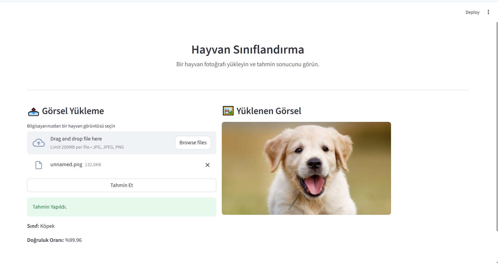

#  Hayvan Görüntüleri Sınıflandırma

Bu proje, eğitilmiş bir yapay zeka modeli kullanarak hayvan görüntülerini
sınıflandıran, Streamlit tabanlı bir web uygulamasıdır.

Kullanıcı tarafından yüklenen bir hayvan görseli, model tarafından analiz edilir
ve hangi hayvan sınıfına ait olduğu tahmin edilerek kullanıcıya gösterilir.


---

##  Kullanılan Teknolojiler ve Kütüphaneler

Projede aşağıdaki teknolojiler ve kütüphaneler kullanılmıştır:

- **Python** Kullanılan dil
- **PyTorch** Derin öğrenme
- **Hugging Face Transformers** Model eğitimi
- **Streamlit** Arayüz
- **Pillow (PIL)** RGB dönüşümü
- **Scikit-learn** Model doğruluğu
- **Numpy** Tahmin sonuçlarınım işlenmesi
- **Matplotlib** Eğitim grafikleri

---

##  Veri Seti

Projede **Animals-10 Dataset** kullanılmıştır. 
Veri seti kaynağı: https://www.kaggle.com/datasets/alessiocorrado99/animals10

Veri seti, 10 farklı hayvan sınıfı içermektedir. Veri setindeki sınıf etiketleri orijinal olarak İtalyanca olarak
tanımlanmıştır. Uygulama arayüzünde kullanıcı deneyimini artırmak amacıyla bu etiketler
Türkçe karşılıkları ile gösterilmektedir.

- cane – Köpek  
- cavallo – At  
- elefante – Fil  
- farfalla – Kelebek  
- gallina – Tavuk  
- gatto – Kedi  
- mucca – İnek  
- pecora – Koyun  
- ragno – Örümcek  
- scoiattolo – Sincap
  
---

##  Model Hakkında

> Bilgisayar donanım kısıtları(GPU) nedeniyle model eğitimi farklı bir bilgisayar ortamında gerçekleştirilmiştir.

Projede, Hugging Face Transformers kütüphanesi kullanılarak eğitilmiş bir
görüntü sınıflandırma modeli yer almaktadır.

Model dosyaları `data/` klasörü içinde bulunmaktadır:

- `model.safetensors`
- `config.json`
- `preprocessor_config.json`
- `training_args.bin`
- `checkpoint-*`

Bu projede, görüntü sınıflandırma görevleri için yaygın olarak kullanılan
Vision Transformer (ViT) mimarisi tercih edilmiştir.
- `google/vit-base-patch16-224`

### Eğitim Parametreleri
- Epoch Sayısı: **7**
- Batch Size: **16**
- Learning Rate: **2e-5**
- Optimizer: **AdamW**
- Kayıp Fonksiyonu: **Cross Entropy Loss**

  
### Eğitilen model dosyası
Model dosyalarına aşağıdaki bağlantı üzerinden erişilebilir
https://drive.google.com/drive/folders/13LNSnupAexF-FZyBJpBzg6wNA-ZBH5GO?usp=drive_link


---

##  Eğitim Sonuçları

Eğitim sürecinde elde edilen çıktılara göre:

- Eğitim kaybı (Training Loss) epoch’lar ilerledikçe azalmıştır  
- Doğrulama kaybı (Validation Loss) düşük ve stabil seviyede kalmıştır  
- Doğrulama doğruluğu (Validation Accuracy) yaklaşık **%98.8** seviyesine ulaşmıştır  

Eğitim sürecine ait **Loss** ve **Accuracy** grafikleri aşağıdaki dosyada yer almaktadır:

 `eğitim_sonuçları.jpeg`
---

##  Web Arayüzü (Streamlit)

Geliştirilen Streamlit tabanlı web arayüzü sayesinde kullanıcılar:

- Bilgisayarlarından bir hayvan görseli yükleyebilir  
- Tek tıklama ile sınıflandırma tahmini alabilir  
- Tahmin edilen sınıfı ve doğruluk oranını görüntüleyebilir  

Arayüz, sade ve kullanıcı dostu olacak şekilde tasarlanmıştır. Arayüzün ekran görüntüsü aşağıdaki gibidir:



### Demo Videosu
https://drive.google.com/file/d/1xJZ2xJVo6Eira_t3INLoA1GtFtQ4SYgQ/view?usp=drive_link

---

##  Uygulamayı Çalıştırma

Uygulamayı çalıştırmadan önce gerekli Python kütüphanelerinin kurulu olması gerekmektedir.

Gereklilikler:
- Python 3.9 veya üzeri
- Kütüphaneler
- Proje dosyaları
- Eğitilmiş modelin bulunduğu `data/` klasörü

Gerekli ortam sağlandıktan sonra uygulama aşağıdaki komut ile çalıştırılabilir:

```bash
streamlit run app.py
